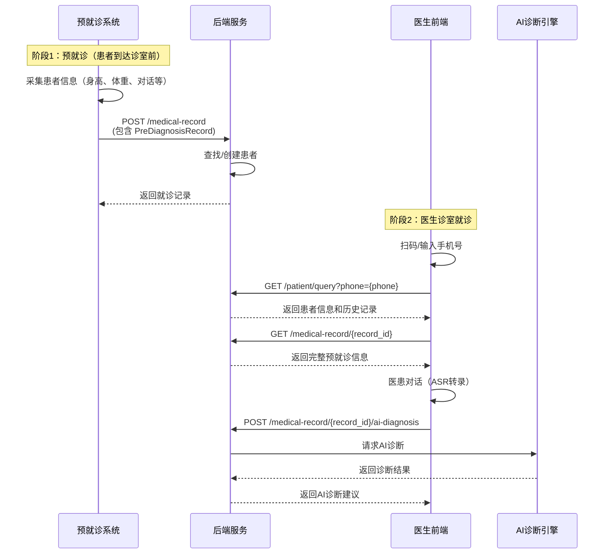

# API 文档

## 概述

DitanBackend 提供了一套完整的中医诊疗管理API，包括患者管理、就诊记录管理和AI辅助诊断功能。

## 基础信息

- **Base URL**: `http://your-domain:8000`
- **API Version**: v1
- **API Prefix**: `/api/v1`

## 认证

部分API端点需要JWT认证。需要认证的端点需要在请求头中携带访问令牌：

```
Authorization: Bearer <access_token>
```

获取访问令牌的方式：通过医生登录接口 `POST /api/v1/doctor/login` 获取。

---

## 系统工作流程

### 完整就诊流程



### 关键要点

1. **预就诊在患者到达医生诊室前完成**：预就诊系统独立完成数据采集，并调用后端API上传数据
2. **患者自动创建**：后端根据PreDiagnosisRecord中的手机号查找患者，如不存在则自动创建
3. **二维码作用**：用于查找患者信息和就诊记录，不是注册新患者
4. **数据流向**：预就诊系统 → 后端 → 医生诊室

---

## 端点列表

### 1. 健康检查

#### GET /health

检查应用健康状态。

**响应**

```json
{
  "status": "healthy",
  "service": "DitanBackend",
  "version": "1.0.0"
}
```

---

### 2. 医生管理

#### 2.1 医生注册

**POST** `/api/v1/doctor/register`

新医生注册账户。

**请求体**

```json
{
  "username": "doctor_zhang",
  "password": "password123",
  "name": "张医生",
  "gender": "MALE",
  "phone": "13800138000",
  "department": "中医科",
  "position": "主治医师",
  "bio": "擅长中医诊疗，从业10年"
}
```

**字段说明**

- `username` (必填): 用户名，3-50位，只能包含字母、数字和下划线
- `password` (必填): 密码，至少6位
- `name` (必填): 医生姓名，2-50位
- `gender` (必填): 性别，可选值: "MALE", "FEMALE", "OTHER"
- `phone` (必填): 手机号，11位数字
- `department` (可选): 科室，最多100位
- `position` (可选): 职位，最多100位
- `bio` (可选): 个人简介

**响应示例**

```json
{
  "success": true,
  "message": "医生注册成功",
  "data": {
    "doctor_id": 1,
    "username": "doctor_zhang",
    "name": "张医生",
    "gender": "MALE",
    "phone": "13800138000",
    "department": "中医科",
    "position": "主治医师",
    "bio": "擅长中医诊疗，从业10年",
    "created_at": "2024-01-01T10:00:00",
    "updated_at": "2024-01-01T10:00:00",
    "last_login": null
  }
}
```

**错误响应**

- 400: 参数验证失败
- 409: 用户名或手机号已被注册

---

#### 2.2 医生登录

**POST** `/api/v1/doctor/login`

医生使用用户名或手机号和密码登录系统。

**请求体**

```json
{
  "username": "doctor_zhang",
  "password": "password123"
}
```

或者使用手机号登录：

```json
{
  "username": "13800138000",
  "password": "password123"
}
```

**字段说明**

- `username` (必填): 用户名或手机号（支持两种方式）
- `password` (必填): 密码

**响应示例**

```json
{
  "success": true,
  "message": "登录成功",
  "data": {
    "access_token": "eyJhbGciOiJIUzI1NiIsInR5cCI6IkpXVCJ9...",
    "token_type": "bearer",
    "doctor": {
      "doctor_id": 1,
      "username": "doctor_zhang",
      "name": "张医生",
      "gender": "MALE",
      "phone": "13800138000",
      "department": "中医科",
      "position": "主治医师",
      "bio": "擅长中医诊疗，从业10年",
      "created_at": "2024-01-01T10:00:00",
      "updated_at": "2024-01-01T10:00:00",
      "last_login": "2024-01-01T14:00:00"
    }
  }
}
```

**错误响应**

- 401: 用户名/手机号或密码错误

---

#### 2.3 获取当前医生信息

**GET** `/api/v1/doctor/me`

获取当前登录医生的账户信息。

**认证**: 需要JWT令牌

**请求头**

```
Authorization: Bearer <access_token>
```

**响应示例**

```json
{
  "success": true,
  "message": "获取医生信息成功",
  "data": {
    "doctor_id": 1,
    "username": "doctor_zhang",
    "name": "张医生",
    "gender": "MALE",
    "phone": "13800138000",
    "department": "中医科",
    "position": "主治医师",
    "bio": "擅长中医诊疗，从业10年",
    "created_at": "2024-01-01T10:00:00",
    "updated_at": "2024-01-01T10:00:00",
    "last_login": "2024-01-01T14:00:00"
  }
}
```

**错误响应**

- 401: 未认证或令牌无效

---

#### 2.4 更新医生信息

**PUT** `/api/v1/doctor/me`

更新当前登录医生的账户信息。

**认证**: 需要JWT令牌

**请求头**

```
Authorization: Bearer <access_token>
```

**请求体**（所有字段都是可选的）

```json
{
  "name": "张伟",
  "gender": "MALE",
  "phone": "13800138001",
  "department": "中医科",
  "position": "副主任医师",
  "bio": "擅长中医诊疗和运动康复，从业15年"
}
```

**响应示例**

```json
{
  "success": true,
  "message": "医生信息更新成功",
  "data": {
    "doctor_id": 1,
    "username": "doctor_zhang",
    "name": "张伟",
    "gender": "MALE",
    "phone": "13800138001",
    "department": "中医科",
    "position": "副主任医师",
    "bio": "擅长中医诊疗和运动康复，从业15年",
    "created_at": "2024-01-01T10:00:00",
    "updated_at": "2024-01-01T15:00:00",
    "last_login": "2024-01-01T14:00:00"
  }
}
```

**错误响应**

- 400: 参数验证失败
- 401: 未认证或令牌无效
- 409: 手机号已被其他医生使用

---

#### 2.5 修改密码

**POST** `/api/v1/doctor/change-password`

修改当前登录医生的登录密码。

**认证**: 需要JWT令牌

**请求头**

```
Authorization: Bearer <access_token>
```

**请求体**

```json
{
  "old_password": "password123",
  "new_password": "newpassword456"
}
```

**字段说明**

- `old_password` (必填): 旧密码
- `new_password` (必填): 新密码，至少6位

**响应示例**

```json
{
  "success": true,
  "message": "密码修改成功",
  "data": null
}
```

**错误响应**

- 400: 旧密码不正确
- 401: 未认证或令牌无效

---

### 3. 患者管理

#### 3.1 通过手机号查询患者

**GET** `/api/v1/patient/query`

根据手机号查询患者信息和历史就诊记录。

**认证**: 需要JWT令牌

**请求头**

```
Authorization: Bearer <access_token>
```

**查询参数**

- `phone` (必填): 患者手机号，11位数字

**响应示例**

```json
{
  "success": true,
  "message": "患者信息查询成功",
  "data": {
    "patient": {
      "patient_id": 1,
      "name": "张三",
      "sex": "MALE",
      "birthday": "1985-05-20",
      "phone": "13800138001"
    },
    "medical_records": [
      {
        "record_id": 1,
        "uuid": "550e8400-e29b-41d4-a716-446655440000",
        "status": "completed",
        "created_at": "2024-01-01T10:00:00",
        "patient_name": "张三",
        "patient_phone": "13800138001"
      }
    ]
  }
}
```

**错误响应**

- 401: 未认证或令牌无效
- 404: 患者不存在

---

#### 3.2 注册新患者（从二维码）⚠️ 已废弃

**POST** `/api/v1/patient/register` ⚠️ **已废弃（Deprecated）**

> **重要提示：** 此接口已废弃，不再推荐使用。
>
> **推荐做法：**
> 1. 预就诊系统调用 `POST /api/v1/medical-record` 上传预就诊数据
> 2. 后端会自动根据手机号查找或创建患者
> 3. 医生端使用 `GET /api/v1/patient/query?phone={phone}` 查询患者信息
>
> 此接口保留仅为向后兼容，未来版本可能移除。

<details>
<summary>接口详情（点击展开）</summary>

从二维码数据注册新患者。

**请求体**

```json
{
  "card_number": "CARD001",
  "name": "张三",
  "phone": "13800138001",
  "gender": "MALE",
  "birthday": "1985-05-20",
  "target_weight": "70"
}
```

**字段说明**

- `card_number` (必填): 会员卡号
- `name` (必填): 患者姓名
- `phone` (必填): 手机号，11位数字
- `gender` (必填): 性别，可选值: "MALE", "FEMALE", "OTHER"
- `birthday` (必填): 出生日期，格式: YYYY-MM-DD
- `target_weight` (可选): 目标体重

**响应示例**

```json
{
  "success": true,
  "message": "患者注册成功",
  "data": {
    "patient_id": 1,
    "name": "张三",
    "sex": "MALE",
    "birthday": "1985-05-20",
    "phone": "13800138001"
  }
}
```

**错误响应**

- 400: 参数验证失败
- 409: 手机号已注册

</details>

---

### 4. 就诊记录管理

#### 4.1 创建就诊记录（核心接口）

**POST** `/api/v1/medical-record`

创建新的就诊记录，包含预诊信息。

**认证**: ⚠️ 不需要认证（此接口由其他系统模块调用，非医生前端调用）

**使用场景：** 预就诊系统完成数据采集后，调用此接口上传预就诊记录。

**核心特性：**

- ✅ 自动创建患者：如果患者不存在（根据手机号判断），系统会自动创建
- ✅ 幂等性保证：使用UUID避免重复创建
- ✅ 完整数据保存：包括预诊记录、三诊分析结果等
- ⚠️ 无需认证：供预就诊系统调用，不需要JWT令牌

**请求体**

```json
{
  "uuid": "550e8400-e29b-41d4-a716-446655440001",
  "patient_phone": "13800138001",
  "patient_info": {
    "name": "张三",
    "sex": "MALE",
    "birthday": "1985-05-20",
    "phone": "13800138001"
  },
  "pre_diagnosis": {
    "uuid": "660e8400-e29b-41d4-a716-446655440001",
    "height": 175.0,
    "weight": 80.0,
    "coze_conversation_log": "患者：我最近体重增加了...",
    "sanzhen_analysis": {
      "face": "面色略黄，唇色偏淡",
      "tongue_front": "舌体偏胖，舌苔薄白",
      "tongue_bottom": "舌下络脉正常",
      "pulse": "脉象沉细",
      "diagnosis_result": "脾虚湿困"
    }
  }
}
```

**字段说明**

- `uuid` (必填): 就诊记录UUID，客户端生成
- `patient_phone` (必填): 患者手机号
- `patient_info` (可选): 如果患者不存在，需提供患者信息
- `pre_diagnosis` (必填): 预诊记录
    - `uuid` (必填): 预诊记录UUID
    - `height` (可选): 身高(cm)
    - `weight` (可选): 体重(kg)
    - `coze_conversation_log` (可选): 与数字人的对话记录
    - `sanzhen_analysis` (可选): 三诊分析结果
        - `face`: 面诊结果
        - `tongue_front`: 舌诊正面
        - `tongue_bottom`: 舌诊舌下
        - `pulse`: 脉诊结果
        - `diagnosis_result`: 综合诊断结果

**响应示例**

```json
{
  "success": true,
  "message": "就诊记录创建成功",
  "data": {
    "record_id": 1,
    "patient_id": 1,
    "uuid": "550e8400-e29b-41d4-a716-446655440001",
    "status": "pending",
    "created_at": "2024-01-01T10:00:00",
    "updated_at": "2024-01-01T10:00:00",
    "patient": {
      "patient_id": 1,
      "name": "张三",
      "sex": "MALE",
      "birthday": "1985-05-20",
      "phone": "13800138001"
    },
    "pre_diagnosis": {
      "pre_diagnosis_id": 1,
      "record_id": 1,
      "uuid": "660e8400-e29b-41d4-a716-446655440001",
      "height": 175.0,
      "weight": 80.0,
      "coze_conversation_log": "患者：我最近体重增加了...",
      "sanzhen_result": {
        "sanzhen_id": 1,
        "face": "面色略黄，唇色偏淡",
        "tongue_front": "舌体偏胖，舌苔薄白",
        "tongue_bottom": "舌下络脉正常",
        "pulse": "脉象沉细",
        "diagnosis_result": "脾虚湿困"
      },
      "created_at": "2024-01-01T10:00:00",
      "updated_at": "2024-01-01T10:00:00"
    }
  }
}
```

**错误响应**

- 400: 参数验证失败，或患者不存在且未提供患者信息
- 409: 就诊记录UUID已存在

---

#### 4.2 获取就诊记录详情

**GET** `/api/v1/medical-record/{record_id}`

获取完整的就诊记录信息，包括患者信息、预诊记录和诊断记录。

**认证**: 需要JWT令牌

**请求头**

```
Authorization: Bearer <access_token>
```

**路径参数**

- `record_id`: 就诊记录ID

**响应示例**

```json
{
  "success": true,
  "message": "就诊记录查询成功",
  "data": {
    "record_id": 1,
    "uuid": "550e8400-e29b-41d4-a716-446655440001",
    "status": "completed",
    "created_at": "2024-01-01T10:00:00",
    "updated_at": "2024-01-01T10:30:00",
    "patient": {
      "patient_id": 1,
      "name": "张三",
      "sex": "MALE",
      "birthday": "1985-05-20",
      "phone": "13800138001"
    },
    "pre_diagnosis": {
      "pre_diagnosis_id": 1,
      "record_id": 1,
      "uuid": "660e8400-e29b-41d4-a716-446655440001",
      "height": 175.0,
      "weight": 80.0,
      "sanzhen_result": {
        "sanzhen_id": 1,
        "face": "面色略黄",
        "tongue_front": "舌苔薄白",
        "tongue_bottom": "舌下正常",
        "pulse": "脉象沉细",
        "diagnosis_result": "脾虚湿困"
      },
      "created_at": "2024-01-01T10:00:00",
      "updated_at": "2024-01-01T10:00:00"
    },
    "diagnoses": [
      {
        "diagnosis_id": 1,
        "record_id": 1,
        "type": "AI_DIAGNOSIS",
        "formatted_medical_record": "主诉：体重增加\n病史：身高175cm，体重80kg...",
        "type_inference": "脾虚湿困型",
        "prescription": "党参 10g\n麸炒白术 15g\n茯苓 15g...",
        "exercise_prescription": "第一周：快走30分钟，每周5次...",
        "diagnosis_explanation": "患者肢体困重，懒言少动...",
        "response_time": 10.5,
        "model_name": "deepseek-chat",
        "created_at": "2024-01-01T10:15:00",
        "updated_at": "2024-01-01T10:15:00"
      }
    ]
  }
}
```

**错误响应**

- 401: 未认证或令牌无效
- 404: 就诊记录不存在

---

### 5. AI诊断

#### 5.1 生成AI诊断

**POST** `/api/v1/medical-record/{record_id}/ai-diagnosis`

为指定的就诊记录生成AI诊断，包括病历生成、证型判断、处方生成和运动处方。

**认证**: 需要JWT令牌

**请求头**

```
Authorization: Bearer <access_token>
```

**路径参数**

- `record_id`: 就诊记录ID

**请求体**

```json
{
  "asr_text": "医生：您好，请问有什么不舒服？\n患者：我最近体重增加了很多，感觉身体很沉重，容易疲劳..."
}
```

**字段说明**

- `asr_text` (必填): ASR转录的医患对话文本

**响应示例**

```json
{
  "success": true,
  "message": "AI诊断完成",
  "data": {
    "diagnosis_id": 1,
    "record_id": 1,
    "type": "AI_DIAGNOSIS",
    "formatted_medical_record": "主诉：体重增加，身体沉重，易疲劳\n病史：初诊日期2024-01-01，身高175cm，体重80kg，近期体重增加5kg...\n一、问诊及闻诊：\n1、肢体困重[有] 2、懒言少动[有] 3、饭后腹胀[有]...",
    "type_inference": "脾虚湿困型",
    "treatment": null,
    "prescription": "党参 10g\n麸炒白术 15g\n茯苓 15g\n泽泻 15g\n陈皮 10g\n姜厚朴 10g\n山药 15g\n薏苡仁 15g\n升麻 15g\n垂盆草 15g",
    "exercise_prescription": "运动处方（4周计划）：\n\n## 第一周（适应期）\n- 运动类型：快走\n- 运动强度：低强度\n- 运动时长：每次30分钟\n- 运动频率：每周5次\n- 具体安排：\n  周一至周五：快走30分钟\n  周六日：休息或八段锦15分钟\n\n## 第二周（强化期）\n- 运动类型：快走 + 太极拳\n- 运动强度：低中强度\n- 运动时长：每次40分钟\n- 运动频率：每周5次...",
    "diagnosis_explanation": "根据患者症状分析：\n1. 肢体困重，懒言少动，提示脾虚湿困\n2. 饭后腹胀，食欲差，口淡纳差，进一步佐证脾虚\n3. 舌体偏胖，舌苔薄白，边有齿痕，典型脾虚湿困舌象\n4. 脉象沉细，符合脾虚湿困脉象特征\n综合判断为脾虚湿困型肥胖。",
    "response_time": 10.5,
    "model_name": "deepseek-chat",
    "created_at": "2024-01-01T10:15:00",
    "updated_at": "2024-01-01T10:15:00"
  }
}
```

**AI诊断流程**

1. **病历生成**: 从ASR对话文本中提取关键信息，生成结构化病历
2. **证型判断**: 根据病历信息判断中医证型（脾虚湿困型、胃热燔脾型、气滞血瘀型、脾肾阳虚型）
3. **处方生成**: 根据证型和患者具体症状生成个性化中药处方
4. **运动处方**: 根据证型、体质和BMI生成4周运动计划

**错误响应**

- 401: 未认证或令牌无效
- 404: 就诊记录不存在
- 500: AI诊断失败

---

## 错误响应格式

所有错误响应都遵循以下格式：

```json
{
  "success": false,
  "message": "错误消息",
  "detail": "详细错误信息（仅在DEBUG模式下显示）"
}
```

### 常见错误码

- **400 Bad Request**: 请求参数验证失败
- **401 Unauthorized**: 未认证或认证令牌无效
- **404 Not Found**: 资源不存在
- **409 Conflict**: 资源冲突（如重复创建）
- **500 Internal Server Error**: 服务器内部错误

---

## 数据模型

### Gender 枚举

```
MALE - 男性
FEMALE - 女性
OTHER - 其他
```

### DiagnosisType 枚举

```
AI_DIAGNOSIS - AI诊断
DOCTOR_DIAGNOSIS - 医生诊断
```

### 就诊记录状态

```
pending - 待处理
in_progress - 处理中
completed - 已完成
```

---

## 使用流程示例

### 1. 完整的就诊流程（推荐）

#### 阶段1：预就诊系统上传数据

```bash
# 预就诊系统调用：创建就诊记录（自动创建患者）
POST /api/v1/medical-record
{
  "uuid": "550e8400-e29b-41d4-a716-446655440001",
  "patient_phone": "13800138001",
  "patient_info": {
    "name": "张三",
    "sex": "MALE",
    "birthday": "1985-05-20",
    "phone": "13800138001"
  },
  "pre_diagnosis": {
    "uuid": "660e8400-e29b-41d4-a716-446655440001",
    "height": 175.0,
    "weight": 80.0,
    "coze_conversation_log": "患者与数字人的对话记录...",
    "sanzhen_analysis": {
      "face": "面色略黄",
      "tongue_front": "舌苔薄白",
      "tongue_bottom": "舌下正常",
      "pulse": "脉象沉细",
      "diagnosis_result": "脾虚湿困"
    }
  }
}
```

#### 阶段2：医生诊室就诊

```bash
# 0. 医生登录（获取JWT令牌）
POST /api/v1/doctor/login
{
  "username": "doctor_zhang",
  "password": "password123"
}
# 响应包含 access_token，后续请求需要在请求头中携带：
# Authorization: Bearer <access_token>

# 1. 扫码/输入手机号，查询患者信息和历史记录（需要认证）
GET /api/v1/patient/query?phone=13800138001
Authorization: Bearer <access_token>

# 2. 获取完整的预就诊信息（需要认证）
GET /api/v1/medical-record/1
Authorization: Bearer <access_token>

# 3. 医患对话后，生成AI诊断（需要认证）
POST /api/v1/medical-record/1/ai-diagnosis
Authorization: Bearer <access_token>
{
  "asr_text": "医生：您好，请问有什么不舒服？\n患者：我最近体重增加了很多..."
}

# 4. 查看完整就诊记录（包括AI诊断）（需要认证）
GET /api/v1/medical-record/1
Authorization: Bearer <access_token>
```

### 2. 老患者复诊流程

```bash
# 1. 预就诊系统上传数据（不需要提供patient_info，无需认证）
POST /api/v1/medical-record
{
  "uuid": "550e8400-e29b-41d4-a716-446655440002",
  "patient_phone": "13800138001",
  "pre_diagnosis": {
    "uuid": "660e8400-e29b-41d4-a716-446655440002",
    "height": 175.0,
    "weight": 78.0
  }
}

# 2. 医生登录
POST /api/v1/doctor/login
{
  "username": "doctor_zhang",
  "password": "password123"
}

# 3. 医生端查询（会显示历史记录，需要认证）
GET /api/v1/patient/query?phone=13800138001
Authorization: Bearer <access_token>
```

---

## 注意事项

1. **认证要求**:
    - 医生端的所有查询和诊断接口都需要JWT认证
    - 医生需要先调用登录接口获取 `access_token`
    - 在后续请求中需要在请求头携带：`Authorization: Bearer <access_token>`
    - 预就诊系统的上传接口（`POST /medical-record`）不需要认证
2. **令牌有效期**: JWT令牌默认有效期为24小时，过期后需要重新登录
3. **UUID生成**: 客户端需要生成UUID（v4格式）用于就诊记录和预诊记录
4. **手机号格式**: 必须是11位数字，以1开头
5. **日期格式**: 统一使用 ISO 8601 格式 (YYYY-MM-DD)
6. **AI诊断耗时**: AI诊断通常需要10-20秒，请做好超时处理
7. **环境变量**: 需要配置 `AI_API_KEY`, `AI_BASE_URL`, `AI_MODEL_NAME`, `JWT_SECRET_KEY` 等环境变量

---

## 环境配置

### 必需的环境变量

```bash
# 数据库配置
DATABASE_HOST=localhost
DATABASE_PORT=5432
DATABASE_USER=username
DATABASE_PASSWORD=password
DATABASE_NAME=ditan

# 应用配置
APP_NAME=DitanBackend
APP_VERSION=1.0.0
APP_HOST=0.0.0.0
APP_PORT=8000
APP_DEBUG=False

# 日志配置
LOG_LEVEL=INFO
LOG_FILE=logs/app.log

# AI模型配置
AI_API_KEY=your_api_key
AI_BASE_URL=https://api.deepseek.com
AI_MODEL_NAME=deepseek-chat

# JWT认证配置
JWT_SECRET_KEY=your-secret-key-change-this-in-production
JWT_ALGORITHM=HS256
JWT_ACCESS_TOKEN_EXPIRE_MINUTES=1440  # 24小时
```

---

## API测试

可以使用内置的Swagger UI进行API测试：

- Swagger UI: `http://your-domain:8000/docs`
- ReDoc: `http://your-domain:8000/redoc`

---

## 更新日志

### v2.1.0 (2024-01-20)

- 🔒 为患者查询、就诊记录查询和AI诊断接口添加医生认证
- 🔒 医生端所有API接口（除预就诊上传）现在需要JWT令牌认证
- 📝 更新API文档，明确标注哪些接口需要认证
- ✅ 更新测试用例，支持认证测试
- 🎯 优化工作流程说明，明确医生登录步骤

### v2.0.0 (2024-01-15)

- 新增医生管理功能
- 新增医生注册和登录功能
- 新增JWT认证机制
- 新增医生信息管理和密码修改功能
- 更新DoctorDiagnosisRecord关联到Doctor实体

### v1.0.0 (2024-01-01)

- 实现患者管理功能
- 实现就诊记录管理
- 集成AI诊断引擎
- 添加运动处方生成功能
- 完整的中医证型判断和处方生成
